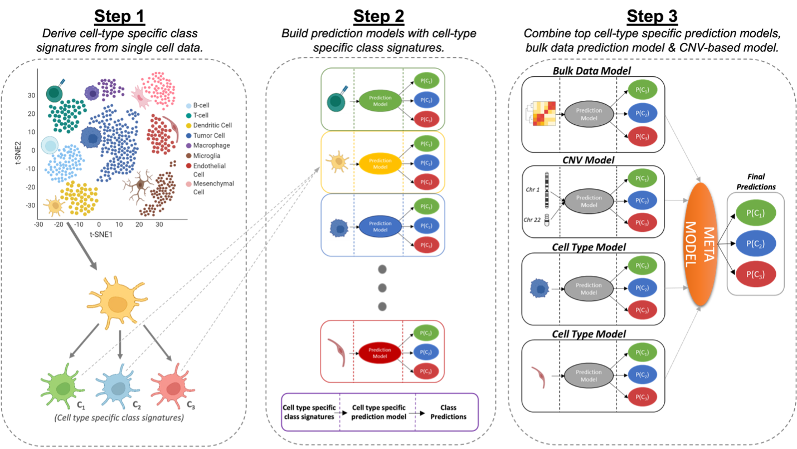

# CLIPPR
**CLIPPR** is an algorithm that combines the top-performing **single-cell** models with RNA-inferred **copy number variation (CNV)** signals and the initial **bulk** model to create a **meta-model**, which exhibits the strongest performance in meningioma classification. It shows superior overall accuracy and resolved benign-malignant confusion. The generalizability of CLIPPR has been validated using our single-cell and bulk glioma data. CLIPPR synergizes the resolution of single-cell data with the depth of bulk sequencing, enabling improved cancer sub-group diagnoses and insights into their biology.

## Model Description
CLIPPR is a meta-model that predicts the meningioma classes by leveraging single-cell data and RNA-inferred CNV signal to enhance the prediction accuracy of bulk data classifiers. We demonstrate that combining the top-performing single-cell models, CNV models, and the initial bulk model into a meta-model resulted in the strongest performance, with superior overall accuracy and benign-malignant resolution. The overview of the CLIPPR algorithm is shown below.  
  

  
The input for CLIPPR consists of aligned single-cell and bulk RNA-seq read counts, as well as the bulk RNA-seq training cohort sample names and tumor classes (subtypes). Additionally, the input requires the tumor classes and cell types for each cell within the single-cell data.

## Application

